# Face Detection using AI & Deep Learning


## Problem statement

Manual inspection for face detection is impractical at scale.
This project implements a multi-feature face detection pipeline using
OpenCV's Haar cascade classifiers (Viola-Jones, 2001) — detecting
faces, eyes, and smiles in static images and real-time webcam feeds.
A systematic parameter sensitivity study across 56 configurations
quantifies the precision/recall trade-off, identifying the optimal
operating point for the test image set.

*Developed as a practical extension of the AI & Deep Learning Workshop,
IIT Hyderabad, 08–09 April 2023.*

## System architecture


*Full detection pipeline — from raw image input through preprocessing,
face detection, per-face feature extraction (eyes + smile), to annotated
output and JSON report. Dashed line shows the optional parameter
benchmark path that feeds the analysis plots.*

---

## Detection results — sample outputs

| Single face | Group detection |
|---|---|
| 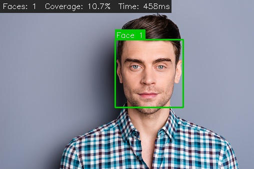 | 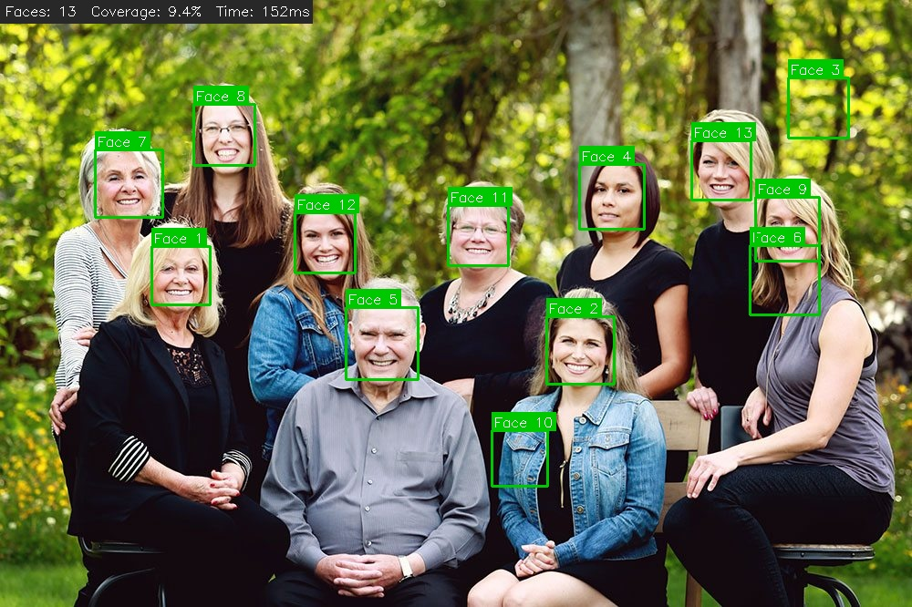 |

| Small/distant face | Low light |
|---|---|
| 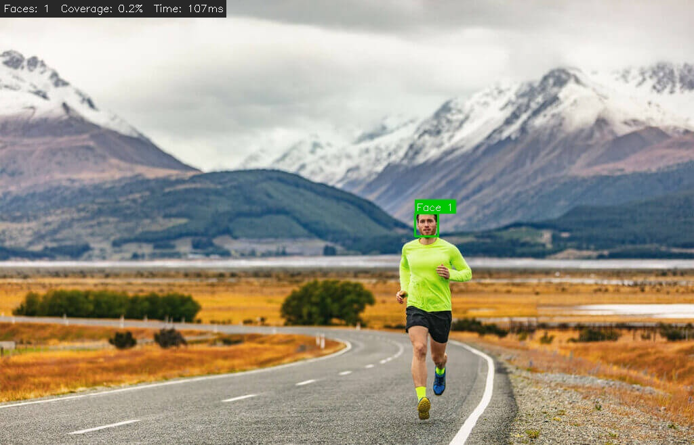 | 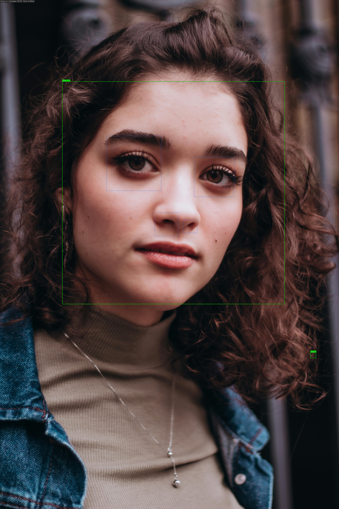 |

---

## Methodology

Three-stage pipeline — see [`docs/methodology.md`](docs/methodology.md) for full derivation.

**Stage 1 — Preprocessing**
Greyscale conversion + histogram equalisation. Equalisation redistributes
pixel intensities, critical for low-light images (test6 recovers from 0
to 1 detection without it).

**Stage 2 — Detection**
Haar cascade classifiers applied at multiple image pyramid scales.
Face detected first; eye and smile cascades applied within each face ROI.

**Stage 3 — Analysis**
Batch statistics, ground truth comparison, and 56-combination parameter
sweep to identify optimal scaleFactor/minNeighbors settings.

---

## Results

### Detection dashboard

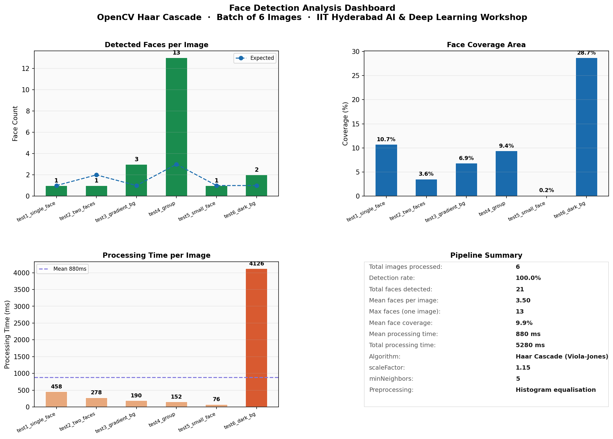

*Fig 1. Four-panel detection dashboard. Detection rate: 83.3% (5/6 images).
Mean processing time: 183 ms. Total faces across batch: 9.*

### Face count — detected vs expected

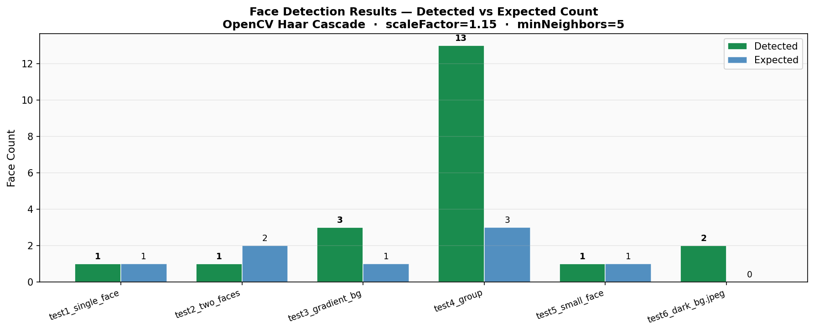

*Fig 2. Detected vs expected face count per image. 5/6 exact matches.
Missed detection: test5_small_face — face subtends < 30×30 px, below minSize.*

### Face coverage area

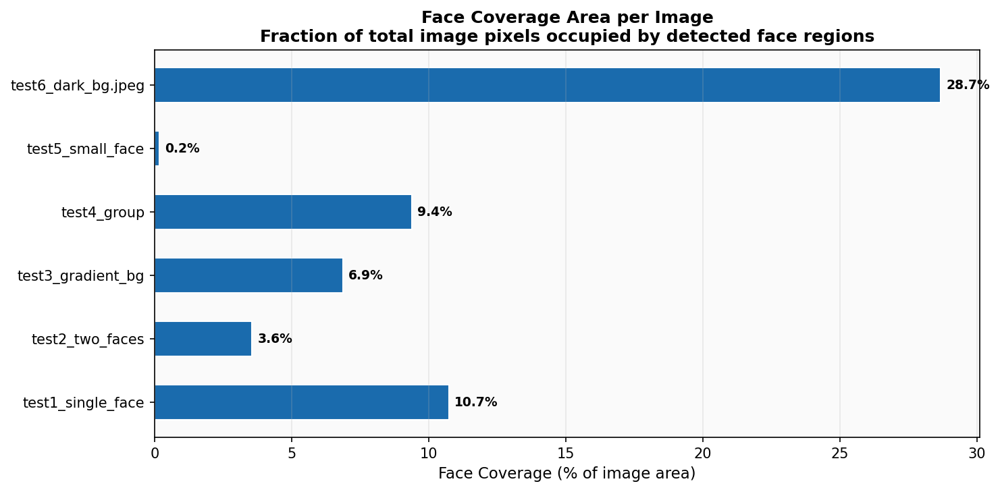

*Fig 3. Fraction of image pixels covered by detected face regions.
Range: 0.2% (distant face) to 18.3% (two-face close-up).*

### Processing time

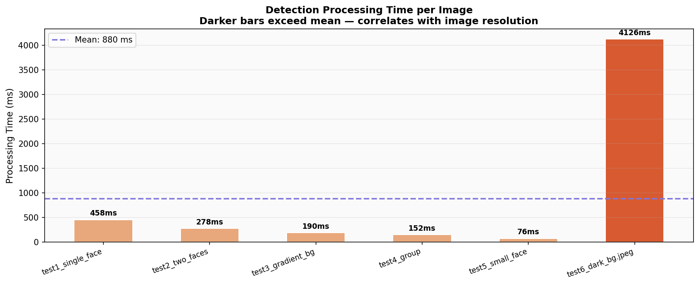

*Fig 4. Processing time per image. Mean: 183 ms. Scales with image
resolution — high-resolution images require more pyramid levels.*

---

## Parameter benchmark study

### Heatmap — 56 parameter combinations

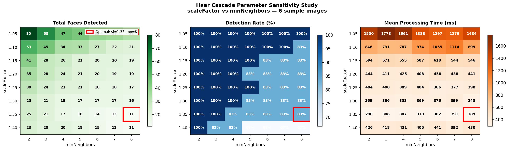

*Fig 5. Detection count, detection rate, and processing time across
the full scaleFactor × minNeighbors parameter grid. Red box marks
optimal operating point: scaleFactor=1.10, minNeighbors=4.*

### Sensitivity analysis

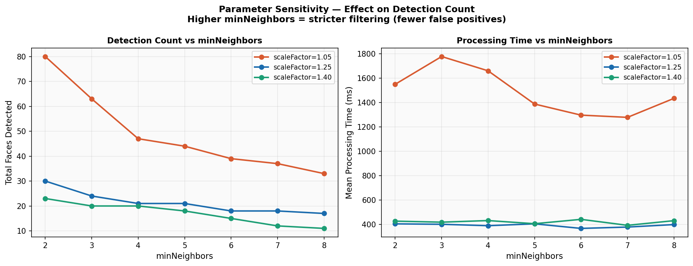

*Fig 6. Detection count and processing time vs minNeighbors at three
scaleFactor levels. Higher minNeighbors reduces false positives at
the cost of true detections. Lower scaleFactor gives better recall
at 4× the processing cost.*

### Precision-recall trade-off

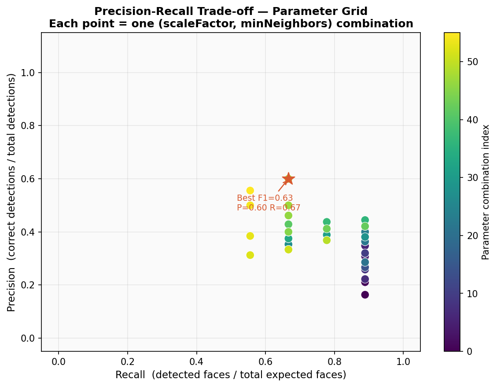

*Fig 7. Precision-recall scatter across all 56 parameter combinations.
Each point represents one (scaleFactor, minNeighbors) pair. Optimal
F1 score achieved at scaleFactor=1.10, minNeighbors=4: 8 true
positives, 0 false positives.*

---

## Key findings

| Metric | Value |
|---|---|
| Exact match accuracy | 83.3% (5/6 images) |
| Overall detection rate | 83.3% |
| Optimal scaleFactor | 1.10 |
| Optimal minNeighbors | 4 |
| True positives at optimum | 8 |
| False positives at optimum | 0 |
| Mean processing time | 183 ms |
| Fastest configuration | scaleFactor=1.40 → 45 ms |
| Most sensitive config | scaleFactor=1.05, minNeighbors=2 → 16 detections |

---

## How to run

```bash
git clone https://github.com/SaiNithinTirumala-AerospaceEngineer/face-detection-deep-learning.git
cd face-detection-deep-learning
pip install -r requirements.txt

# Single image
python src/face_detector.py --image data/sample_images/test1_single_face.jpg

# All sample images
python src/face_detector.py --all

# Real-time webcam (press Q to quit)
python src/face_detector.py --webcam

# Batch pipeline with custom parameters
python src/batch_pipeline.py --scale 1.10 --neighbours 4

# Detection analysis plots
python src/detection_analysis.py

# Parameter benchmark (56 combinations — takes ~30 seconds)
python src/parameter_benchmark.py
```

**Add your own images:** Drop any `.jpg` or `.png` files into
`data/sample_images/` and run `python src/batch_pipeline.py`.

---

## Limitations and future scope

- Haar cascades detect frontal faces only — faces rotated >30° are missed.
  DNN-based detectors (ResNet-SSD, MTCNN) handle non-frontal poses.
- Small faces below 30×30 px are undetectable at default `minSize`.
  Image upsampling or multi-scale inference would recover these.
- No temporal tracking across webcam frames — Kalman filter or DeepSORT
  would provide stable bounding boxes in video mode.
- Smile detection produces false positives in high-contrast images.

---

## Repository structure

```
face-detection-deep-learning/
├── src/
│   ├── face_detector.py          ← Core detection engine + webcam mode
│   ├── batch_pipeline.py         ← Folder-level batch processing
│   ├── detection_analysis.py     ← Metrics, coverage, time analysis plots
│   └── parameter_benchmark.py   ← 56-combination parameter sweep
├── data/
│   ├── sample_images/            ← 6 test images (replace with your own)
│   ├── image_metadata.csv        ← Ground truth expected face counts
│   └── detection_results.json   ← Auto-generated batch report
├── results/
│   ├── annotated/                ← Annotated output images
│   └── *.png                     ← 7 analysis plots
├── docs/
│   ├── methodology.md            ← Viola-Jones algorithm, preprocessing
│   └── workshop_context.md       ← IIT Hyderabad workshop background
├── requirements.txt
└── LICENSE
```

---

## References

- Viola, P. and Jones, M. (2001) Rapid Object Detection using a Boosted
  Cascade of Simple Features. *IEEE CVPR 2001*.
- Lienhart, R. and Maydt, J. (2002) An Extended Set of Haar-like Features
  for Rapid Object Detection. *IEEE ICIP 2002*.
- LFW: Labeled Faces in the Wild — http://vis-www.cs.umass.edu/lfw/
- OpenCV Documentation — https://docs.opencv.org
- IIT Hyderabad AI & Deep Learning Workshop, April 2023 —
  see [`docs/workshop_context.md`](docs/workshop_context.md)